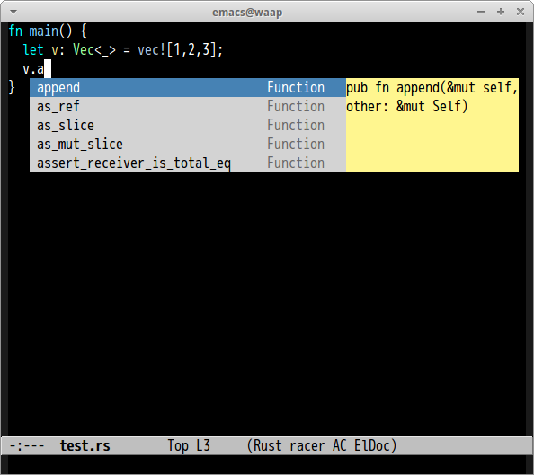

# ac-racer.el

ac-racer.el is an auto-complete source of [racer](https://github.com/phildawes/racer) for rust language.

## Screenshot



## Configuration

You must set `racer-cmd` and `racer-rust-src-path`.

```lisp
(custom-set-variables
 '(racer-cmd (expand-file-name "your racer path"))
 '(racer-rust-src-path (expand-file-name "your rust source code path")))
```
